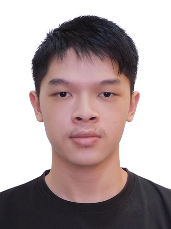
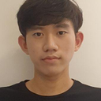

# About Us

We are a team based in the [School of Computing, National University of Singapore](http://www.comp.nus.edu.sg).

You can reach us at the email `seer[at]comp.nus.edu.sg`

## Project team

### Teh Hock Jian

[[homepage](http://www.comp.nus.edu.sg/~damithch)]
[[github](https://github.com/hxckjian)]
[[portfolio](team/hxckjian.md)]

* Role: Developer
* Project Responsibilities: Testing
* Development Responsibilities: UI

### Teh Huan Xi Kester

[[homepage](https://www.tehdrink.com)]
[[github](https://github.com/tehdrink)]
[[portfolio](team/tehdrink.md)]

* Role: Developer
* Project Responsibilities: Lead, Scheduling and Tracking
* Development Responsibilities: UI

### Julian Lim

[[github](http://github.com/jj910)] [[portfolio](team/jj910.md)]

* Role: Developer
* Project Responsibilities: Deliverables and deadlines
* Development Responsibilities: Integration

### Hwang Jihun

[[github](http://github.com/hwangjihun)]
[[portfolio](team/hwangjihun.md)]

* Role: Developer
* Project Responsibilities: In charge of Storage Component
* Development Responsibilities: Code Quality

### Xie YingWen

[[github](https://github.com/YingWen178)]
[[portfolio](team/yingwen178.md)]

* Role: Developer
* Role: Documentation
* Responsibilities: Storage
